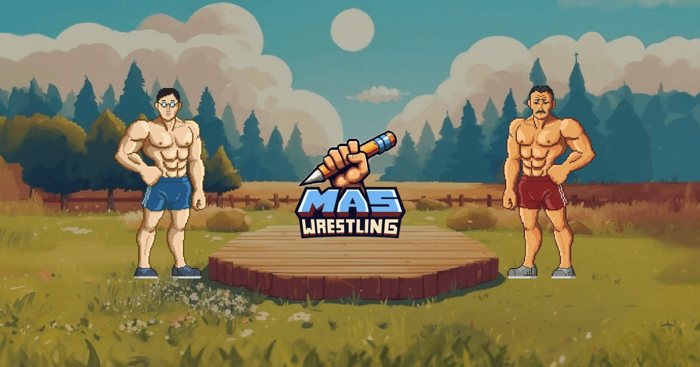
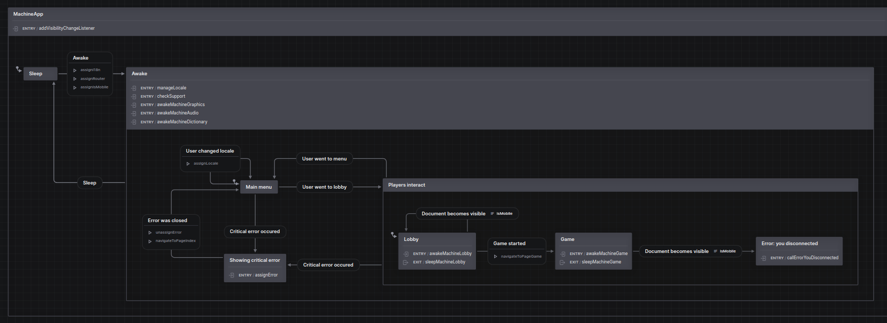

# The Superviral Word Game



You can play this game [right here](https://the-superviral-word-game.com).

What can be interesting here for developers:

1. [How I used XState to save the world of managing game state](#xstate).
2. [How I wrote my own mini WebGL-engine inspired by pixijs](#webgl).
3. [How I made CloudFlare Worker to behave like normal server](#cloudflare-worker).
4. [JSON array of 108092 english nouns](#english-nouns).
5. [How to develop your own version of this game](#development).

Stack:

Frontend: vue 3, xstate, typescript, vite-ssg, tailwind

Backend: cloudflare pages (static hosting), cloudflare workers (websocket), twilio (STUN/TURN servers)

## XState

[XState is a state management and orchestration solution for JavaScript and TypeScript apps](https://stately.ai/docs/xstate).

One of it's many killer features is that it allows you to have a graphical representation of your business logic.



[Check how all of the game logic sits on fancy graceful diagrams](./frontend/src/machines/).

Moreover, I use XState for E2E-testing solution too, [check it here](./frontend/e2e/).

Visual representation is so cool that even non-programmer can actually understand what the hell is happening in your code.

Also, you can forget about documentation, because, well, XState produces it automatically.

And, as if this were not enough, XState has an [awesome inspector](https://stately.ai/docs/inspector), which allows you to visually observe how your machines transitions in realtime and debug them.

https://github.com/the-illarionov/the-superviral-word-game/assets/3993003/bdd267e3-e6e1-478a-bf59-6dd40dfa2dd0

I MEAN HOW COOL IS THAT?

## WebGL

I am a big fan of computer graphics, so it was very fun to toy with native WebGL.

I wrote custom graphics engine inspired by [pixijs](https://pixijs.com/), you can [check it here](./frontend/src/machines/MachineGraphics/Engine/).

## CloudFlare Worker

Nothing special actually, but there is one trick to make worker behave like normal server.

Worker sits on distributed edge and doesn't exist as one instance so it's pretty tricky to share state. And that's the exact problem [CloudFlare Durable Objects](https://developers.cloudflare.com/durable-objects/) solve.

So you have a [storage](https://developers.cloudflare.com/durable-objects/reference/in-memory-state/) which is consistent and shares state between multiple worker instances. But the problem is it must be serializable, so we can't hold a direct reference to an object there.

So i've come with solution which utilizes [alarms](https://developers.cloudflare.com/durable-objects/api/alarms/). It pings my Durable Object instance every 10 seconds so it keeps alive.

The cost of it is 300k requests per month, but it's totally fine for me, because CloudFlare provides 10 million requests per month at a basic paid plan.

You can check worker source code [here](./backend/src/).

# English nouns

You can use my custom list of 108 092 english nouns in [JSON array](./.dictionaries/txttojson/volume/json/en.json).

At first, I've collected all of the available english nouns in [txt format](./txttojson/volume/txt_additional/en.txt).

Then I generated another [txt file](./txttojson/volume/txt/en.txt) using [nltk](./nltk/).

And then combined them into [JSON array](./txttojson/volume/json/en.json), excluding duplicates using [nodejs](./txttojson/volume/change.js).

# Development

If you want tp create your own version of this game, you need to have [docker](https://www.docker.com/) and [taskfile](https://taskfile.dev/) installed. The rest is fully dockerized.

If you launch for the first time:
```
cd .dev
task env
task init
task up
```

If not:
```
cd .dev
task up
```

And that's all!

But remember that accoding to [license](./LICENSE), you can distribute your version of the game only on non-commercial open-source conditions.
