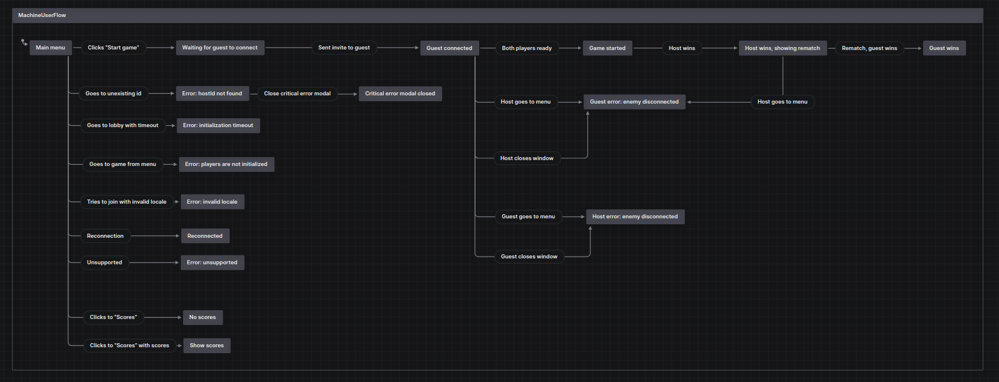

# E2E testing with XState

XState has an awesome package [@xstate/test](https://stately.ai/docs/xstate-test), which allows you to make your machine test providers.

You can create test models from your existing machines and treat it like "unit-testing" of your machines.

However, I prefer a different approach, when you create a separate machine for e2e-testing, which describes all of the possible user interactions with flows.

The event-based nature of state machines just fits perfectly with how users interact with the application.
