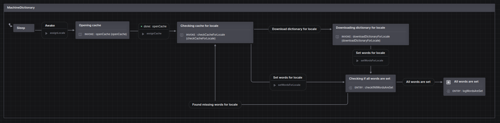
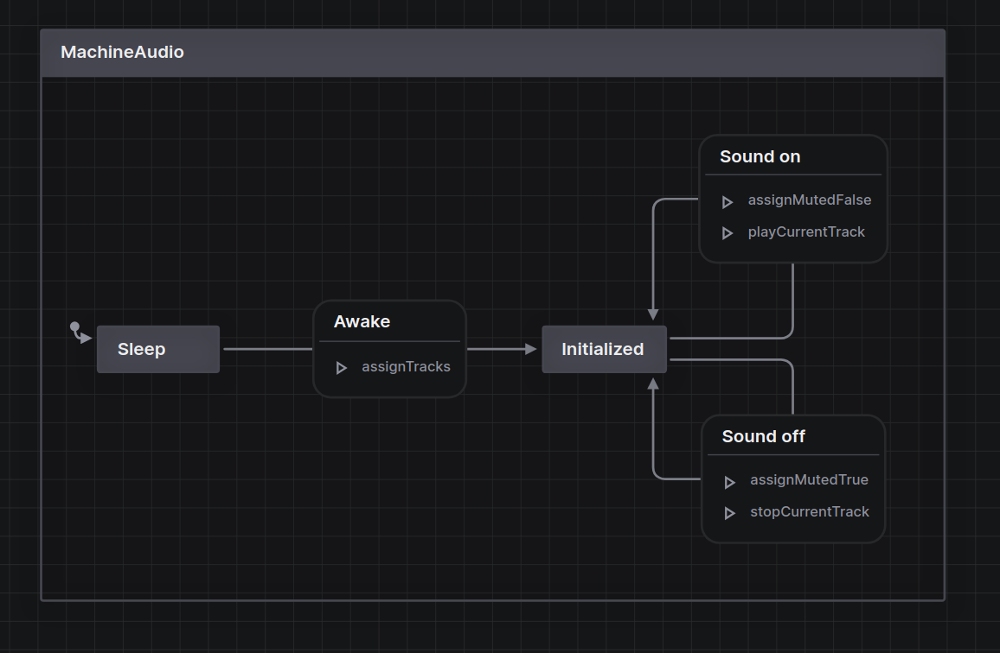
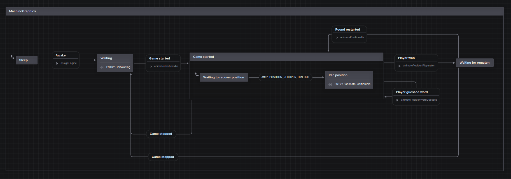
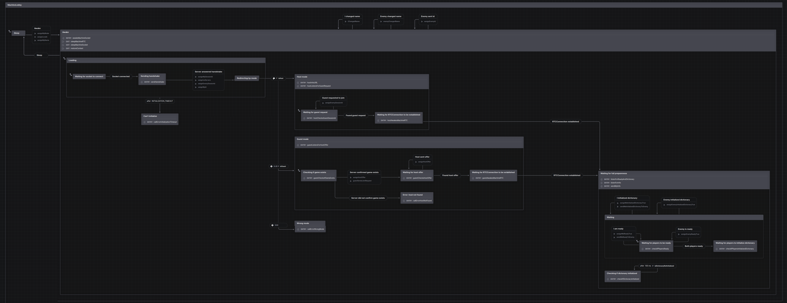
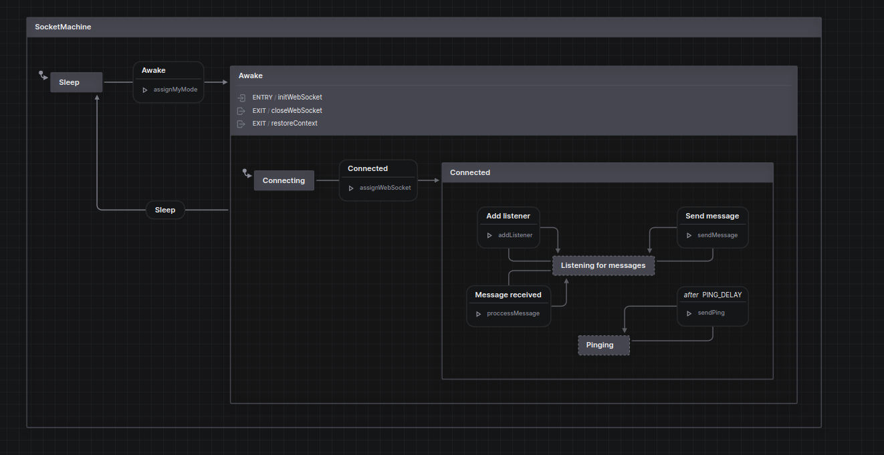
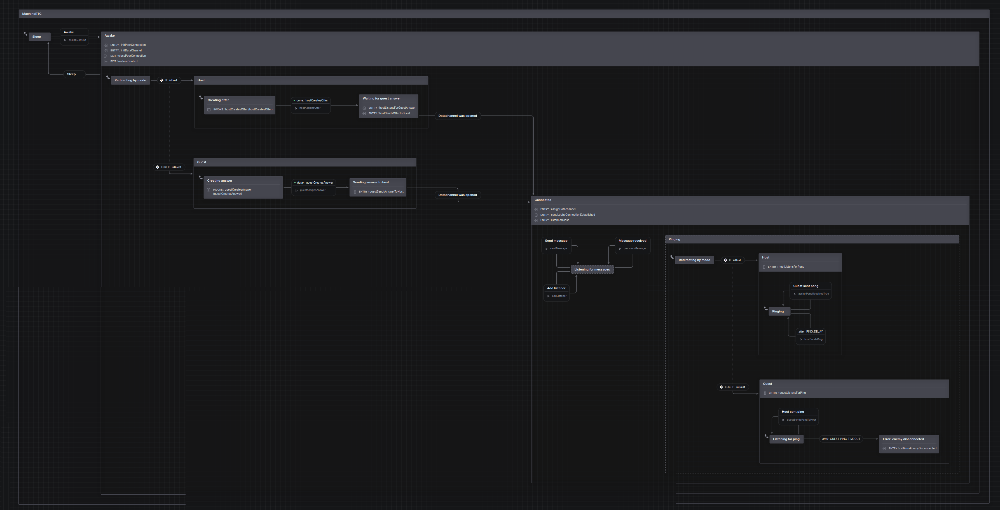
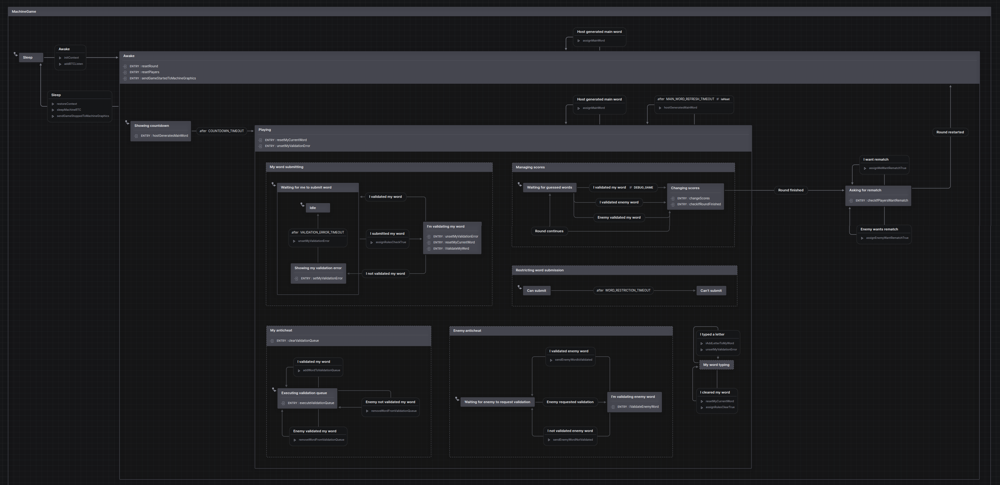

# XState machines

All of the machines are global singletons. Normally, you would _spawn_ (or _invoke_) machines, but in this particular case it was ok to have them as  global singletons.

__MachineApp__, main machine, which controls everything. It sleeps and awakes all of the other machines, which is essentially almost the same thing as spawning or invoking.

---

__MachineDictionary__ loads all of the required words and stores them in Cache.

---

__MachineAudio__ is reponsible for playing sounds.

---

__MachineGraphics__ manages all of the interaction with the  WebGL engine.

---

__MachineLobby__ is pretty complicated, it holds the logic of connecting players.

---

__MachineSocket__ establishes connection with WebSocket server, which is a CloudFlare Worker.

---

__MachineRTC__ is responsible for establishing WebRTC connection and communication between players.

---

And finally, __MachineGame__ is the machine which starts when game starts and manages all of the game logic: word guessing, scoring, rematching etc.

The most complicated one, even with custom anticheat system.

---

See? You can give a glance and you understand the whole upper-level logic. The magic is that if it even was something much more complicated, it actually won't be much more complicated (sorry about that).

All of the stuff you see like `ENTRY / initHostUrl` are called `actions` and you can look at their implementation in the machine file.

See? XState is such a huge lifesaver, just imagine how would you implement all of that in traditional way, document it and then onboard new developers.

Using visual representation just removes all of that struggling.

Another huge advantage is it dismisses lots of bugs, because now your application can only be in one particular state.
